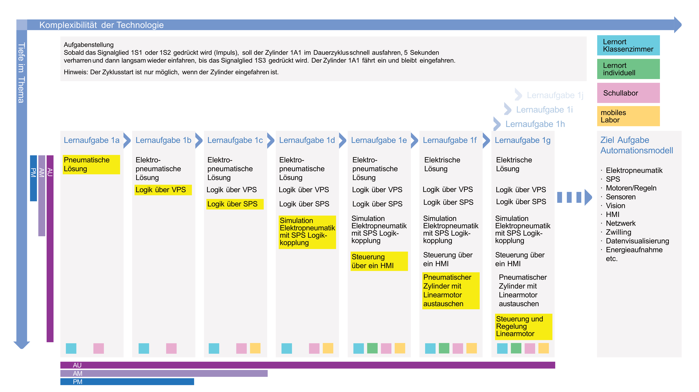

Lernpfade beschreiben den Lernweg, den Lernende üblicherweise für ein Lernfeld sequenziell durchlaufen. 
Idealerweise durchlaufen Lernpfade alle Lernprozesse von der Ressourcenaktivierung bis zur
Auswertung der Lernergebnisse. Sie können rein explorativ oder eng geführt gestaltet werden. 
Lernpfade ermöglichen eine individualisierte Ausbildung in der Berufsfachschule und den überbetrieblichen Kursen.  
<a href="https://futuremem.swiss/assets/inhalt/Downloads/MEM-Ausbildungskonzept-FUTUREMEM-Kurzform-Juni-23.pdf" target="_blank">MEM-Ausbildungskonzept FUTUREMEM Kurzform Juni 23 DE S.18</a>

## Lernpfad Pneumatik - VPS -SPS

{style="width:100%"}

Für das Bearbeiten der Aufgaben orientiert man sich an der Methode IPERKA. Das konkrete Ausschaffen der einzelnen Aufgabenstellungen wird hier nicht behandelt.
Ziel ist es aufzuzeigen, wie mit einer durchgängigen Toolchain und individuell-verfügbaren HW, kosten-optimiert, die geforderte Handlungskompetenzorientierung umgesetzt werden kann.
