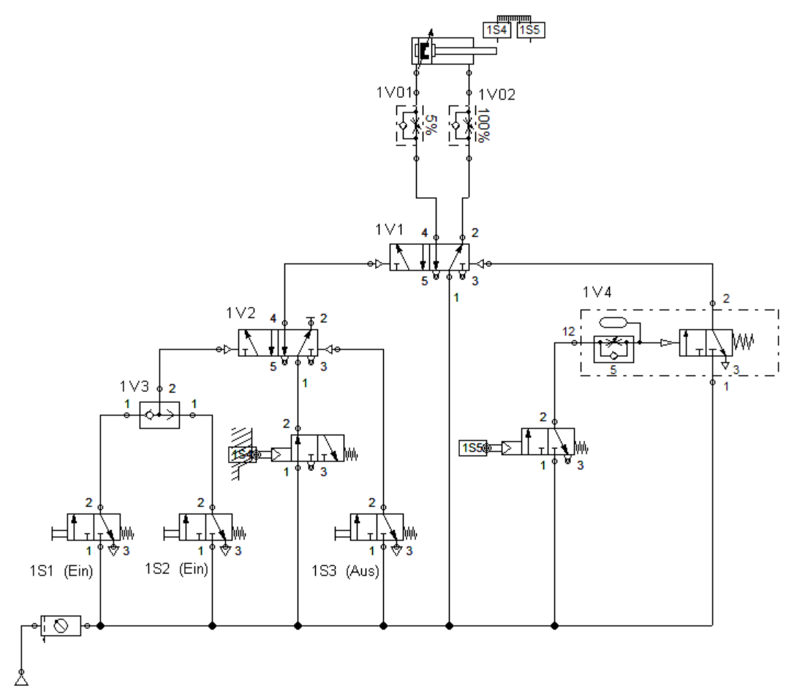

{ style="width:50%"}

=== "Aufgabenstellung"
    Sobald das Signalglied 1S1 oder 1S2 gedrückt wird (Impuls), soll der Zylinder 1A1 im Dauerzyklus schnell ausfahren, 5 Sekunden verharren und dann langsam wieder einfahren, bis das Signalglied 1S3 gedrückt wird. Der Zylinder 1A1 fäührt ein und bleibt eingefahren.
    Hinweis: Der Zyklusstart ist nur möglich, wenn der Zylinder eingefahren ist.

=== "Lernfelder"
    | ID LFE                                                                                                                                                       | Name LFE                         |
    | :----------------------------------------------------------------------------------------------------------------------------------------------------------- | :------------------------------- |
    | <a href="https://futuremem-docs-xemax.eu.pythonanywhere.com/de/data/4000_lfe_00/#4ABDBD42-BE55-A54C-8DEE-16DDE576B8DB" target="_blank">LFB_Aa_AaHa</a>       | Fehleranalyse Hardware           |
    | <a href="https://futuremem-docs-xemax.eu.pythonanywhere.com/de/data/4000_lfe_00/#A9BBDC4D-9C11-704C-89E3-F3DC0CD85EB0" target="_blank">LFB_Aa_AaHS</a>       | Fehleranalyse Hard- und Software |
    | <a href="https://futuremem-docs-xemax.eu.pythonanywhere.com/de/data/4000_lfe_02/#CA4BFD57-C0ED-5648-BBD9-791CD4011384" target="_blank">LFB_Mt_Mo1</a>        | Montagetechnik                   |
    | <a href="https://futuremem-docs-xemax.eu.pythonanywhere.com/de/data/4000_lfe_03/#6A5626D3-EF14-234A-960B-DD2A822A8408" target="_blank">LFB_Pn_PNAA</a>       | Schemen lesen                    |
    | <a href="https://futuremem-docs-xemax.eu.pythonanywhere.com/de/data/4000_lfe_03/#A7BD7EEA-2185-1C4C-9698-3F563EECB56E" target="_blank">LFB_Pn_PNBA</a>       | Grundschaltungen Pneumatik       |
    | <a href="https://futuremem-docs-xemax.eu.pythonanywhere.com/de/data/4000_lfe_03/#FB36F6D4-725D-BC4F-B3A7-2A2D2F997453" target="_blank">LFB_Pn_PNBB</a>       | Betriebsmittel bezeichnen        |
    | <a href="https://futuremem-docs-xemax.eu.pythonanywhere.com/de/data/4000_lfe_03/#DD5F1F2A-B3E1-DB47-A60F-44881BC4BC58" target="_blank">LFB_Pn_PNBE</a>       | Betriebsmittel einsetzen         |
    | <a href="https://futuremem-docs-xemax.eu.pythonanywhere.com/de/data/4000_lfe_03/#431EE942-A82D-7C42-8AE8-2C77F4714B4A" target="_blank">LFB_Pn_PNEN</a>       | Pneumatikschaltungen entwickeln  |
    | <a href="https://futuremem-docs-xemax.eu.pythonanywhere.com/de/data/4000_lfe_03/#4720C9CC-BEE9-4647-B27B-DD1AE83B8C73" target="_blank">LFB_Pn_PNSS</a>       | Schemas skizzieren               |
    | <a href="https://futuremem-docs-xemax.eu.pythonanywhere.com/de/data/4000_lfe_03/#6F4F2408-50A3-FC43-A6F4-B7E527BB2AA6" target="_blank">LFB_Pn_PNSZ</a>       | Schemen zeichnen                 |
    | <a href="https://futuremem-docs-xemax.eu.pythonanywhere.com/de/data/4000_lfe_02/#CA4BFD57-C0ED-5648-BBD9-791CD4011384" target="_blank">LFB_Tg_bew_auf_1</a>  | Bewegende Technik Aufbau         |
    | <a href="https://futuremem-docs-xemax.eu.pythonanywhere.com/de/data/4000_lfe_02/#CA4BFD57-C0ED-5648-BBD9-791CD4011384" target="_blank">LFB_Tg_bew_auf_2</a>  | Bewegende Technik Aufbau         |
    | <a href="https://futuremem-docs-xemax.eu.pythonanywhere.com/de/data/4000_lfe_02/#CA4BFD57-C0ED-5648-BBD9-791CD4011384" target="_blank">LFB_Tg_bew_bas</a>    | Bewegende Technik Basis          |
    | <a href="https://futuremem-docs-xemax.eu.pythonanywhere.com/de/data/4000_lfe_02/#CA4BFD57-C0ED-5648-BBD9-791CD4011384" target="_blank">LFB_Tg_geh_auf_1</a>  | Geheimnis Kräfte Aufbau          |
    | <a href="https://futuremem-docs-xemax.eu.pythonanywhere.com/de/data/4000_lfe_02/#CA4BFD57-C0ED-5648-BBD9-791CD4011384" target="_blank">LFB_Tg_geh_auf_2</a>  | Geheimnis Kräfte Aufbau          |
