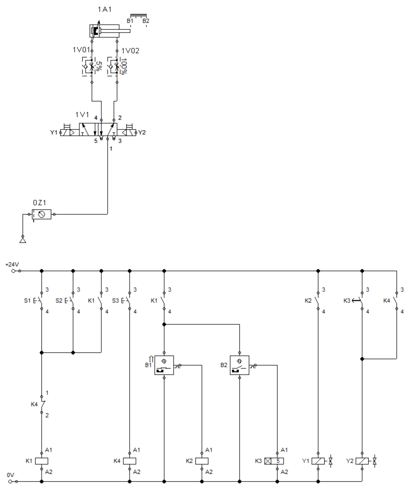

=== "Mögliche Lernfelder"
    | ID LFE                                                                                                                                                       | Name LFE                                                               |
    | :----------------------------------------------------------------------------------------------------------------------------------------------------------- | :--------------------------------------------------------------------- |
    | <a href="https://futuremem-docs-xemax.eu.pythonanywhere.com/de/data/4000_lfe_00/#4ABDBD42-BE55-A54C-8DEE-16DDE576B8DB" target="_blank">LFB_Aa_AaHa</a>       | Fehleranalyse Hardware                                                 |
    | <a href="https://futuremem-docs-xemax.eu.pythonanywhere.com/de/data/4000_lfe_00/#A9BBDC4D-9C11-704C-89E3-F3DC0CD85EB0" target="_blank">LFB_Aa_AaHS</a>       | Fehleranalyse Hard- und Software                                       |
    | <a href="https://futuremem-docs-xemax.eu.pythonanywhere.com/de/data/4000_lfe_00/#456851AB-1DFF-8343-B99E-866FB47668E8" target="_blank">LFB_ES_cil</a>        | Entstehung von Logikschaltungen                                        |
    | <a href="https://futuremem-docs-xemax.eu.pythonanywhere.com/de/data/4000_lfe_00/#1752BAD4-4106-C040-9B7C-B85D031BB64E" target="_blank">LFB_Es_Ks_Ef</a>      | Einfache Kleinspannungssteuerungen verstehen und aufbauen              |
    | <a href="https://futuremem-docs-xemax.eu.pythonanywhere.com/de/data/4000_lfe_00/#DF2DE14B-4A07-1D45-B325-01890A1A3288" target="_blank">LFB_Es_Ns_Ef</a>      | Einfache Niederspannungssteuerungen verstehen und aufbauen             |
    | <a href="https://futuremem-docs-xemax.eu.pythonanywhere.com/de/data/4000_lfe_02/#4F6D1388-1AEB-5D45-82EA-AE24BB2CA3BB" target="_blank">LFB_In_IBN</a>        | Inbetriebnahme                                                         |
    | <a href="https://futuremem-docs-xemax.eu.pythonanywhere.com/de/data/4000_lfe_02/#3E8D12CA-DB8E-894D-BB88-B027AA4C319F" target="_blank">LFB_In_IBS</a>        | In Betriebs Setzung                                                    |
    | <a href="https://futuremem-docs-xemax.eu.pythonanywhere.com/de/data/4000_lfe_02/#8045EB34-E5B4-C544-B0C8-744109F0AA0F" target="_blank">LFB_MEM_PLG1b</a>     | Prozesse lesen und gestalten 3-3                                       |
    | <a href="https://futuremem-docs-xemax.eu.pythonanywhere.com/de/data/4000_lfe_02/#06E8BEBE-1BD0-FB48-8B65-020FD4AA660E" target="_blank">LFB_MEM_PLG2</a>      | Prozesse lesen und gestalten 2-3                                       |
    | <a href="https://futuremem-docs-xemax.eu.pythonanywhere.com/de/data/4000_lfe_02/#CA4BFD57-C0ED-5648-BBD9-791CD4011384" target="_blank">LFB_Mt_Mo1</a>        | Montagetechnik                                                         |
    | <a href="https://futuremem-docs-xemax.eu.pythonanywhere.com/de/data/4000_lfe_03/#95E264F7-ACFA-534D-B169-1ECB88F68B94" target="_blank">LFB_Pn_EkEPV</a>      | Erweiterte und komplexe Elektro-Pneumatische Komponenten Verschlauchen |
    | <a href="https://futuremem-docs-xemax.eu.pythonanywhere.com/de/data/4000_lfe_03/#6A5626D3-EF14-234A-960B-DD2A822A8408" target="_blank">LFB_Pn_PNAA</a>       | Schemen lesen                                                          |
    | <a href="https://futuremem-docs-xemax.eu.pythonanywhere.com/de/data/4000_lfe_03/#A7BD7EEA-2185-1C4C-9698-3F563EECB56E" target="_blank">LFB_Pn_PNBA</a>       | Grundschaltungen Pneumatik                                             |
    | <a href="https://futuremem-docs-xemax.eu.pythonanywhere.com/de/data/4000_lfe_03/#FB36F6D4-725D-BC4F-B3A7-2A2D2F997453" target="_blank">LFB_Pn_PNBB</a>       | Betriebsmittel bezeichnen                                              |
    | <a href="https://futuremem-docs-xemax.eu.pythonanywhere.com/de/data/4000_lfe_03/#DD5F1F2A-B3E1-DB47-A60F-44881BC4BC58" target="_blank">LFB_Pn_PNBE</a>       | Betriebsmittel einsetzen                                               |
    | <a href="https://futuremem-docs-xemax.eu.pythonanywhere.com/de/data/4000_lfe_03/#431EE942-A82D-7C42-8AE8-2C77F4714B4A" target="_blank">LFB_Pn_PNEN</a>       | Pneumatikschaltungen entwickeln                                        |
    | <a href="https://futuremem-docs-xemax.eu.pythonanywhere.com/de/data/4000_lfe_03/#4720C9CC-BEE9-4647-B27B-DD1AE83B8C73" target="_blank">LFB_Pn_PNSS</a>       | Schemas skizzieren                                                     |
    | <a href="https://futuremem-docs-xemax.eu.pythonanywhere.com/de/data/4000_lfe_03/#6F4F2408-50A3-FC43-A6F4-B7E527BB2AA6" target="_blank">LFB_Pn_PNSZ</a>       | Schemen zeichnen                                                       |
    | <a href="https://futuremem-docs-xemax.eu.pythonanywhere.com/de/data/4000_lfe_02/#CA4BFD57-C0ED-5648-BBD9-791CD4011384" target="_blank">LFB_Tg_bew_auf_1</a>  | Bewegende Technik Aufbau                                               |
    | <a href="https://futuremem-docs-xemax.eu.pythonanywhere.com/de/data/4000_lfe_02/#CA4BFD57-C0ED-5648-BBD9-791CD4011384" target="_blank">LFB_Tg_bew_auf_2</a>  | Bewegende Technik Aufbau                                               |
    | <a href="https://futuremem-docs-xemax.eu.pythonanywhere.com/de/data/4000_lfe_02/#CA4BFD57-C0ED-5648-BBD9-791CD4011384" target="_blank">LFB_Tg_bew_bas</a>    | Bewegende Technik Basis                                                |

=== "Mögliche Arbeitssituation"
    An einer automatisierten Montagelinie soll von zwei verschiedenen Orten ein Zylinder (Weiche) gestartet werden, 
    um die Bauteile auf den Bändern auf zwei folgende Montagelinien zu verteilen. Sobald der Start erfolgt ist, 
    schaltet der automatische Zyklus ein. Die Weiche schaltet sofort um, bleibt 5s in Position und fährt dann langsam 
    wieder zurück. Dieser Zyklus wiederholt sich automatisch, bis die STOP-Taste betätigt wird. Wenn die Weiche nicht 
    schon in Grundposition ist fährt sie dahin und bleibt stehen.  
     
    Löse, die Lernaufgabe mit einer elektropneumatischen Schaltung (Logik über VPS).

=== "Mögliche Lösung"
    { style="width:75%"}
